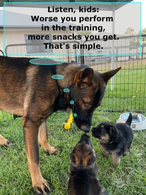

# Why?

There is an opinion that dog training is a waste of time. Some believe that training limits the dog's freedom or turns it into a robot or affects the animal's psyche in a negative way. In some context, all of these theses are true.
The dog training does take a lot of time. However, as we will see later, training teaches the dog how to behave in different situations, often avoiding unnecessary injuries and troubles. For the owner, training is useful in increasing self-organization and discipline. For both, the training is a fun process. Dogs like it because it is a kind of game for them. And in addition, during the game, the dog is spoiled with all sorts of goodies.
If you do not teach the dog to show aggression, attack people or other living creatures, do not train it to be a fighting dog, then the training not only does not harm the dog's psyche, but is also useful. Therefore, dogs themselves often suggest that the owner start a training session. The training is also useful for the human psyche: a lot of dopamine, the hormone of pleasure, is released into the blood when the dog makes progress. This is about the same pleasant feeling when your child performs at a concert in kindergarten or finishes a quarter/year/school with honors.

For many dog owners, their four-legged friend becomes part of the family. As the saying goes, if you don’t talk to your dog, then why do you have a dog? :)
That’s why people are ready to make great sacrifices of time and money so that their family member feels better.
Compared to periodic and unforeseen veterinary visits, taxes, daily expenses for a dog, training is a significantly small investment of time in a mutually beneficial activity.
1. A trained dog is more attached to its owner, trusts him more, and also reduces the risk of getting into unpleasant situations.
2. For both, the person and the dog, the training is a pleasant activity, a game. For the dog, it is also a tasty game.

# The most necessary and important word
Let's place bets! What is the most important word not only in communication with animals, but also in raising children, communicating with relatives, friends, colleagues? What word allows you to build long-term trusting relationships? What word is perceived as an element of friendship, as a promise, as support?

## Yes!

Correct. This word is "Yes". Of course, if you say "yes" to someone, "I will do this job", "I will pick up the child from kindergarten", "I will take care of our vacation", but if you do not do this, your reputation will be destroyed, and it will be difficult, almost impossible to restore it. But as long as your "yes" goes hand in hand with your actions - there is nothing to worry about. "Yes" works for you!

A collar/harness and a leash restrict a dog's freedom. Not every dog happily agrees to be leashed. If every time you put a collar/harness on your dog or fasten a leash you say "Yes!" and reinforce the word with a treat, then the dog changes its attitude to the restriction of freedom. It will even start to come up and ask to be leashed for a treat. Well, it is and also because being leashed to a person on the street, i.e. having a physical connection with a human via the leash, the dog feels safe.

<p align="center">
  
</p>

Why "yes"?

[Pyotr Anokhin proposed a model](https://en.wikipedia.org/wiki/Theory_of_functional_systems), which describes the interaction of all systems in a living organism. As well as the interaction of different parts of each individual system. The model turned out to be universal. It applies to people and animals, plants and even psychology.

Greatly simplifying the description of the model, each system regulates itself using the negative feedback method. This method was already known to 18th century mechanics, who used [centrifugal governor](https://en.wikipedia.org/wiki/Centrifugal_governor) in steam engines to achieve a constant shaft speed.

Thus, if there is too much of something in the system, then a signal about the need to reduce this "something" comes via negative feedback. And vice versa, the greater the lack of something, the stronger the signal about the need to replenish. For example, the more thirsty we are, the more persistently we look for water. And having found it, the more we drink, the less we want to drink.

The connection is called "negative" because the signal to action is opposite in sign to the existing state, but proportional to its state, strength.

The "Functional System" model describes the maintenance of life, homeostasis, the status quo. It is built into our biology and is unchangeable. It keeps us alive. But, alas, it also does not allow us to develop, grow professionally, emotionally, socially.

[Opening the electronic model](EllKiEUK6k4WTmEkADEZkAYkNwgAWWsADwAdAGcGAGAGwAXaxq6ReWQNdkNrY2IABEAYRO2ADM-sc6FcWEA) of the functional system, you can play with it and see how it responds to the intervention.


The driving force behind such development is our restless brain, or, if you like, soul. Each of us has something that we like to do. One or more hobbies, which, once you get busy, you don't notice how time flies. And being distracted, you want to return to it again. Mihaly Csikszentmihalyi calls this state ("Flow")[https://en.wikipedia.org/wiki/Flow_(psychology)]

It turns out that the biology of humans and dogs is quite similar. They also like to have a good time, feel good, experience pleasure and happiness. Unlike a functional system, the flow is maintained by positive feedback. This is when some action gives some pleasure. And then we continue to do the same thing, improving and perfecting the action to get even more pleasure.

What are you good at? In what activity? Many people immediately answer: I sleep and eat well. Now think and answer honestly to yourself. No one will judge or check you. Do you really like doing exactly this? Almost everyone will answer "yes". Why do you like it? The answers and reasons will be different, but the essence is the same for everyone - it's pleasant. Either the process itself, or the result, or both.
And what have you not succeeded in, although you honestly tried? There are such unique people who succeed in everything they undertake. Or they just have a short memory. It is normal NOT to succeed in something. But why? The answer is: because you did not like doing it. Too long, difficult, expensive, boring, confusing, etc. A million reasons are summed up in one simple negative attitude, upsetting feeling.

When we like doing something, we strive to do it more and more often. As a result, we improve in it. And from better results, from progress, we like the chosen activity even more. Of course, we are not born masters of anything, and we do not even become one in one day. Developing a skill takes time. It takes immeasurable willpower to practice for a long time, to improve, in something you do not like. And it does not take any willpower to improve in something you like. In what brings us to the state of the Flow. This is the appeal and effectiveness of positive feedback. It is an exchange of time for pleasure. It is a powerful tool. If it works for us, then we can use it on others. And this is not shameful, because, in the end, everyone will only be better off.

That is why, for example, we avoid those sciences and areas of life that are "not interesting" to us. And we reach out to the "interesting" ones. Interesting and uninteresting are very subjective feelings. For someone, for example, accounting may seem like a super boring occupation. And someone in the same accounting sees a charming interweaving of numbers, revealing the ins and outs of people and corporations, like a thriller leading to an intriguing discovering.

The easiest way to transform an uninteresting activity into an interesting one is to get support from the outside. For example, a child does not like history. Grandfather tells him part of a historical event, puts out the feeler, but does not give the ending. Then the child gets a book or a film where he learns the ending of that story. Naturally, the child brags to his grandfather about his discovery. If the grandfather praises the kid, supports, appreciates, then maybe another historian will appear among us.

If someone speaks to you in a rude manner, and you respond in the same way, then you give him positive support (Positive Feedback). You add fuel to his fire. And he will continue to speak to you in the same way. If you ignore the rudeness and end the conversation rationally and to the point, then the boor will not be interested in being rude to you. On the contrary, the next time he speaks to you neutrally or politely, praise him for his "patience", "grit", "understanding", etc. And you will see that the boor will gradually become the most pleasant interlocutor with you. This is the effect of positive feedback. This is a kind of "Yes".

The word "Yes" itself does not mean anything to a dog, like any other word. But when reinforced with a treat, "Yes" acquires the meaning of Positive Feedback. The dog wants to hear "Yes" more often and get a treat.

## What about "No?"
"No" is, in principle, a useless word. Our brain, its left half, understands "No" logically. It is a prohibition, a denial, a disagreement. But the right, emotional half of the brain, gets frustrated from the word "No". On the one hand, negative emotions arise, on the other hand, it is not clear what and how to do to get positive emotions. It is like going nowhere. Without a clear goal, the brain cannot choose the direction of movement and action. And that means it gets "out of the frying pan and into the fire." Poking at endless "No", we fall into depression, lose interest in life.
Try not to use "No" with those with whom you hope to build a long-term relationship. Do use "Yes" to maintain and strengthen the desired behavior. Do ignore the unwanted behavior.

Note how the advice is given on not using "No". This is not just "No". This is a positive alternative. Positive goal.

## Are there exceptions?

Of course, "yes"! The magic effect of the word "yes," if you notice, applies to **long-term** relationships. If you are sure that you see your interlocutor is the first and last time, you can use "No", "Maybe" or whatever you want. "Yes" is used to shape desirable behavior. One-time or short-term contacts will not change/shape the relationship with you. So there is no point in wasting time, effort and thought on the correct use of positive feedback.
It is important to understand that if there is a chance of long-term relationships, personal or professional, you have no choice. To get desirable behavior from friends, relatives and colleagues, you will have to invest your time and effort in positive feedback.

* Good news: using positive feedback gives you a reputation as a good friend, a friendly colleague.
* Bad news (how to go without them?): the positive feedback does not work immediately, but requires diligence and perseverance.

## Practice
If you have never trained your pet, it is worth starting with this simple exercise. 
1. Prepare a handful of small delicacies so that the dog cannot simply take it. For example, hold in the hand or on a table above the dog’s eyes/nose.
2. Wait until the dog starts to spin around you or sit next to you. It usually happens almost as soon as you start doing something. Dogs are curious.
3. As soon as you see that the dog is distracted from you, look away, for example, immediately call its name 1 time.
4. Wait until the dog looks at you. Maximum 10 seconds.
5. Immediately as the dog looks at you, say "Yes!" loud and cheery and offer it a piece of a treat.
6. Repeat the points 3-5 for 10 times or more.
7. Repeat whole the exercise in another room, on the balcony, in the garden, in the forest/park, while walking the dog.

The last point is especially important. Dog owners are surprised that their pet performs commands well at the trainer's, but barely understands what is required of it at home. Those who train dogs themselves are upset that many commands that the dog performs well at home remain unacknowledged when the owner wants to show off the dog to friends. There is nothing strange about this. Dogs are better integrated into nature than people - for good and for bad. They see and hear not only the owner, but everything that surrounds them. The owner and his commands are only a small part of the overall picture. Therefore, the same command and the same gesture in one room are perceived by the dog differently in another room. By training a dog in different environments, you can teach it to "separate the wheat from the chaff": see and hear the owner and reduce its attention to the motley environment.

What does this knowledge give us? 2 conclusions:
1. If our task is to teach a dog a trick quickly, then it is better to do it in one environment. For example, in the same room or in the same corner of the garden.
2. Having taught the dog one trick, nolens volens you will have to teach it the same thing in several more places. Although this will go faster.

## Recap

The word "Yes" is the first and most important word to teach a dog. During the training, "Yes" should be reinforced with a treat. This way, the dog will associate "Yes" with something good and positive. Use "Yes", the positive feedback, to form the desired skills and behavior in the dog.

"Yes", the positive feedback is a tool for forming the desired behavior. It is important to use it like any other tool - at the right time and right way. Do not say "yes" and do not give the dog a treat without a reason. Do not use the tool when the dog does something wrong. Do not waste "yes" long after the desired behavior. Use "yes" immediately, instantly, as soon as the dog has performed the desired action or at least part of it. Repeat the commands and "yes" many times in different situations.

Bonus: the same effect of "Yes", the positive feedback, works on people. Just choose another word (for example, "Cool", "Excellent", "Well done", etc.) and use only it to form the desired behavior. The second bonus is that with people you can save on treats: people understand words.


# Make hay while the sun is still shining

Each person spends decades of own life to realize the necessity, value and benefits of meditation. In fact, many die without ever meditating. Sad, but true. [Meditation](https://en.wikipedia.org/wiki/Meditation), simply put, is concentration training. Meditation allows a person to concentrate (focus attention) on something for a long time. In our normal state, our brain constantly "jumps" from thought to thought. As philosophers say, "thought chases and devours thought." Meditation exercise teaches a person to concentrate on the desired thought without ignoring the environment. Practical meditation is an exercise in which a person consciously discards all the occupations and worries of the future, all the burdens, grievances and pain of the past, and lives in the present moment. It seems simple, try it once. In the present moment, unusual feelings are revealed to us, with which we live our whole lives and do not notice them.

| After all, life is something that passes by while we are busy with something else. (unknown philosopher) |
|--------------------------------------------------------|

Dogs, in terms of focus, are better than people. Our, human, ability to think abstractly is a gift and a burden at the same time. The ability to think creates and roots in our consciousness the representation of the world, often having nothing common with the reality. To delve into this topic, you could read Daniel Kahneman, Martin Seligman, Dan Rafaeli, Robert Dilts, and others. Dogs do not have the ability to think abstractly. Therefore, they do not need to learn to meditate. From birth, they are able to perceive the entire environment at once, as an integrated environment. At the same time, according to their behavior, dogs quite clearly distinguish the most important irritants from the general hubbub. If a dog does not find an "important" irritant in its environment, it calms down and rests. Dogs spend most of their time in a half-sleep. Dogs naturally live in the present moment. And the present moment for them is what is happening right now.

Various studies show that dogs "remember" a maximum of 7 to 10 seconds ago. Their entire life is our last 7-10 seconds, running forward along with time. Like a train on rails, or like a sliding door in your wardrobe.

```commandline
                                        +---------------+
             does not exist             |     LIFE      |    does not exist
----------------------------------------+---------------+--------------------------> t
                                   -7 seconds          now
```

# About being true to yourself

# Essential commands

# Funny commands

# Briefly

3 rules for successful and effective training:
## 1. Yes!

When training, use only positive feedback with the dog. When the dog does something correctly or almost correctly, say "Yes!" and give a treat to the dog.
The treat should be small pieces so that the dog does not lose focus and interest in training due to chewing, and so that it does not get full quickly
Say "Yes!" emotionally. Emotional feedback is better perceived by the dog.
Over time, just "Yes!" will be enough to reinforce the skill even without a treat.

Do not use "No!" or other negative feedback. The dog does not understand words, but understands emotions. Dogs are empathetic. The owner's negative emotions cause displeasure in the dog. When there is a lot of displeasure, the dog simply does not want to continue training. The game will stop being fun and become hard labor. Who would willingly go to hard labor?
Use "Yes!" to reinforce if the dog's behavior is correct, or ignore its behavior if it is undesirable - without emotion.

## 2. 7 seconds.

A dog's life is the present moment minus 7-10 seconds ago. A dog does not understand the future or the past. Therefore, rewarding or scolding it for something it did later than 7 seconds ago is useless. A dog cannot connect the act of reward/scolding with a distant action.

Give only 1 command for 7-10 seconds. A dog is not a robot or a switch, but a living creature. It will not immediately follow a command it hears or sees, especially at the beginning of training. It needs time to process the command and decide what to do. Therefore, if instead of "Sit!" you impatiently repeat "Sit! Sit! Sit! Sit! Sit!", then the dog will sit only after you say "Sit!" 5 times. Patience will benefit both you and the dog. If the dog has not decided what to do in 10 seconds, the command can be repeated, and again only 1 time.

## 3. The Castle.

Castles are built from bricks, fastened with cement mortar. Each command learned by a dog is a separate castle. That is, it must be built gradually, giving *the same* commands, and reinforcing with *the same* rewards.

"Bricks" are commands. For each action, choose one command. It is advisable to also choose a gesture for this command. A gesture is convenient and important in situations when the dog is not nearby. Then it may not even hear, but see the gesture and perform it correctly.
Example of a command: "Sit". Gesture: palm horizontally with the back side up. Each time you should say only "Sit" and place your palm horizontally.
If you use synonyms (Be sat, Stay sitting, Get sat, Sit down, Keep-calm-and-bless-the-king) or use different gestures with the word "Sit!", then the dog perceives this as different commands. It will take incomparably more time for the dog to combine different commands into one action.
All bricks are the same, so should the commands. Consistency and self-discipline of the owner are the key to successful training. By the way, the command does not necessarily have to make sense in human language. You can teach a dog to sit on the command "Katmandu!", for example. The main thing is to decide for yourself, the owner, which word means what, and to use words appropriately and consistently.

"Cement mortar" is a way of giving commands and rewards. As part of self-discipline, each iteration of training, each attempt to execute a command should not only be the same, but also in a constant sequence:
1. Give a command and do a gesture.
2. Wait for execution for 10 seconds.
3. If the command is executed correctly, then immediately after execution say "Yes!" and offer the dog a treat. If the command is executed incorrectly or not executed, wait 10 seconds and repeat.
4. If you have already given your pet a treat, wait until he swallows it. So that he does not choke during the execution of the next command.

Pay attention to how you give commands. The more variable the command in tone, volume, speed of pronunciation, coordination with the gesture, the more time and iterations it will take you to train the dog.
If the dog "does not understand" what is required to do, perhaps the "bricks" are too big. Think about what smaller actions you want to teach the dog. And teach each action at time in sequential order. As it successfully executes the initial commands, increase the complexity. For example, the command "Serve" consists of "Sit!" and then "Serve".

# Addendum

## Food and Treats

## General Care and Hygiene

## Veterinary Services