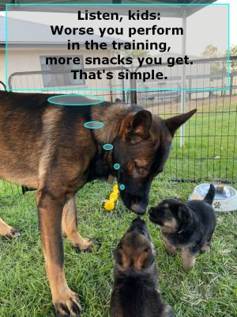

# А зачем?

Есть мнение, что дрессировка - это пустая трата времени. Некоторые считают, что дрессировка ограничивает свободу собаки или делает из нее робота или влияет на психику животного не лучшим образом. В каком-то контексте все эти тезисы верны.
Дрессировка действительно занимает много времени. Однако, как мы увидим дальше, дрессировка учит собаку как вести себя в разных ситуациях, часто избегая лишних травм и неприятностей. Для хозяина дрессировка полезно повышением самоорганизованности и дисциплины. Для обоих, дрессировка - это забавный процесс. Собакам он нравится потому, что для них это своего рода игра. Да еще к тому же во время игры собаку балуют всякими вкусностями.
Если вы не учите собаку проявлять агрессию, нападать на людней или других живых существ, не тренируете ее на бойцовскую собаку, то дрессировка не только не вреда для собачьей психики, но и полезна. Поэтому собаки часто сами предлагают, чтоб хозяин начал сеанс дрессировки.
Для человеческой психики дрессировка тоже полезна: много допамина, гормона удовольствия, выделяется в кровь, когда собака делает успехи. Это примерно то же приятное чувство, когда ваш ребенок выступает на концерте в детском садике или заканчивает четверть/год/школу с отличием.

Для многих собачников, их четвероногий друг становится частью семьи. Как говорится, если вы не разговариваете со своей собакой, то зачем вам собака? :)
Поэтому люди готовы на большие жертвы времени и средств, чтоб их член семью чувствовал себя комфортно.
По сравнению с периодическими и непредвиденными ветеринарными визитами, налогами, повседневными расходами на собаку, дрессировка - значительно небольшое вложение времени в обоюдо-полезное занятие.
1. Дрессированная собака более привязана к хозяину, больше ему доверяет, а также снижет риски попасть в неприятные ситуации.
2. Для обоих, человека и собаки, дрессировка - это приятное занятие, игра. Для собаки - это еще и вкусная игра.

# Самое нужное и важное слово
Давайте делать ставки! Какое слово самое важное не только в общении с животными, но и в воспитании детей, общении с родственниками, друзьями, коллегами? Какое слово позволяет строить долгосрочные доверительные отношения? Какое слово воспринимается, как элемент дружбы, как обещание, как поддержка?

## Да!

Правильно. Это слово "Да". Конечно, если скажете кому-то "да", я сделаю эту работу, я заберу ребенка из садика, я позабочусь о нашем отпуске, но не сделаете этого, ваша репутация будет разрушена и восстановить ее будет непросто, почти невозможно. Но покуда, ваше "да" идет в ногу с вашими поступками - не о чем беспокоиться. "Да" работает на вас!

Ошейник/упряжка и поводок ограничивают свободу собаки. Не каждая собака радостно соглашается быть пристегнутой. Если каждый раз, одевая на собаку ошейник/упряжку или пристегивая поводок вы говорите "Да!" и подкрепляете слово лакомством, то собака меняет свое отношение к ограничению свободы. Она даже сама начнет подходить и просить быть пристегнутой за лакомство. Ну и еще потому, что будучи пристегнутой к человеку на улице, т.е. имея с ним физическую связь посредством поводка, собака чувствует себя в безопасности.

<p align="center">
  </br>
  Слушайте, дети: чем хуже вы выполняете упражнения, тем больше вкусностей получите. Вот так просто!
</p>

Почему именно "да"?

[Петр Анохин предложил модель](https://ru.wikipedia.org/wiki/%D0%A2%D0%B5%D0%BE%D1%80%D0%B8%D1%8F_%D1%84%D1%83%D0%BD%D0%BA%D1%86%D0%B8%D0%BE%D0%BD%D0%B0%D0%BB%D1%8C%D0%BD%D1%8B%D1%85_%D1%81%D0%B8%D1%81%D1%82%D0%B5%D0%BC), которая описывает взаимодействие всех систем в живом организме. А также взаимодействие разных частей каждой отдельно взятой системы. Модель оказалась универсальной. Она подходит к людям и животным, растениям и даже к психологии.

Сильно упрощая описание модели, каждая система регулирует себя методом отрицательной обратной связи. Этот метод известен еще механикам 18 века, которые использовали [центробежный регулятор](https://ru.wikipedia.org/wiki/%D0%A6%D0%B5%D0%BD%D1%82%D1%80%D0%BE%D0%B1%D0%B5%D0%B6%D0%BD%D1%8B%D0%B9_%D1%80%D0%B5%D0%B3%D1%83%D0%BB%D1%8F%D1%82%D0%BE%D1%80) в паровых машинах для достижения постоянной скорости вращения вала.

Таким образом, если чего-то в системе слишком много, то по отрицательной обратной связи приходит сигнал о необходимости снижения этого "чего-то". И наоборот, чем сильнее недостаток чего-либо, тем сильнее сигнал о потребности восполнения. Например, чем сильнее нас мучит жажда, тем настойчивее мы ищем воду. А найдя, чем больше пьем, тем меньше хочется пить.

Связь называется "отрицательной" потому, что сигнал к действию противоположен по знаку к существующему состоянию, но пропорционален его, состоянию, силе.

Модель "Функциональной системы" описывает поддержание жизни, гомеостаза, статуса кво. Она встроена в нашу биологию и неизменна. Она поддерживает в нас жизнь. Но, увы, она же и не позволяет развиваться, расти профессионально, эмоционально, социально.

[Открыв электронную модель](https://www.falstad.com/circuit/circuitjs.html?ctz=CQAgjCAMB0l3BWcZYA4BsB2ATNzZsEBOVA9EBSCiqhAUwFowwAoAeRAGZsqxNzO6VOH7goLAO5ceIbABYq3XqMiTwRbOs1gNsheIBOWvYpnyqteKoCGxvgJn2QRcEiZIwVuOGioikBB1OOXQdVE4iCE5YeXDIIgQIvjlCck8WACU7dF5sYTAcqDF9bGhMagtoBBYAc2NOSDl6wSLVIx1NBqaOkyLPeBYAeyL0JqoFEllKiEUK6k4WTmEkADEZkAYkNwgAWWsADwAdAGcANUGAGwAXaxq6ReWQNdkNrY2IABEAYRO2ADM-sc6FcWEA) функциональной системы, вы можете с ней поиграть и посмотреть как она отзывается на вмешательство.


Движителем такого развития является наш беспокойный мозг, или, если хотите, душа. У каждого из нас есть что-то, что нам нравится делать. Одно или больше увлечений, занявшись которыми, не замечаешь как пролетело время. А будучи отвлеченным, хочется вернуться к этому снова. Михай Чиксентмихай называет это состояние ("Поток")[https://ru.wikipedia.org/wiki/%D0%9F%D0%BE%D1%82%D0%BE%D0%BA_(%D0%BF%D1%81%D0%B8%D1%85%D0%BE%D0%BB%D0%BE%D0%B3%D0%B8%D1%8F)]

Оказывается, биология людей и собак довольна идентична. Им тоже нравится приятно проводить время, чувствовать себя хорошо, испытывать удовольствие и счастье. В отличии от функциональной системы, поток удерживается положительной обратной связью. Это когда какое-то действие дает некое удовольствие. И тогда мы продолжаем делать то же самое, улучшая и совершенствуя действие, чтоб получить еще больше удовольствия.

Поэтому, например, те науки и области жизни, которые нам "неинтересны", мы избегаем. А к "интересным" тянемся. Интересное и неинтересное - это очень субъективное ощущение. Для кого-то, к примеру, бухгалтерия может казаться суперскучным занятием. А кто-то в той же бухгалтерии видит чарующее сплетение чисел, раскрывающее подноготную людей и корпорации, как триллер ведущее к интригующей развязке.

Самый простой способ преобразовать неинтересное занятие в интересное - это получить поддержку из вне. Например, ребенок не любит историю. Дедушка рассказывает ему часть исторического события, закидывает удочку, но не дает развязку. Потом ребенок получает книгу или фильм, где он узнает развязку той истории. Естественно, ребенок хвастается дедушке о своем открытии. Если дедушка похвалит малыша, поддержит, одобрит, то может быть среди нас появится еще один историк. 

Если к вам кто-то обращается по-хамски, и вы также и отвечаете, то вы даете ему положительную поддержку (Положительную обратную связь). Подливаете масло в его костер. И он будет и дальше к вам также обращаться. Если же вы проигнорируете хамство и завершите беседу рационально и предметно, то хаму будет неинтересно вам хамить. Напротив, когда в следующий раз он к вам обратиться нейтрально или вежливо, похвалите его за "терпение", "выдержку", "понимание" и т.д. И увидите, что с вами хам постепенно станет самым приятным собеседником. Это и есть эффект положительной обратной связи. Это и есть своего рода "Да".

Само по себе слово "Да" для собаки не значит ничего, как и любые другие слова. Но будучи подкрепленным лакомством "Да" приобретает смысл Положительной обратной связи. Собака хочет чаще слышать "Да" и получать лакомство. 

## А как же "Нет?"
"Нет", в принципе, бесполезное слово. Наш мозг, его левая половина, понимает "Нет" логически. Это запрет, отрицание, несогласие. Но вот правая, эмоциональная половина мозга, от слова "Нет" попадает во фрустрацию. С одной стороны, возникают отрицательные эмоции, с другой стороны - непонятно что и как сделать, чтоб получить положительные эмоции. Это как идти в никуда. Не имея ясной цели, мозг не может выбрать направление движения и действия. А значит попадает "из огня да в полымя". Тыкаясь в бесконечные "Нет", мы впадаем в депрессию, теряем интерес к жизни.
Старайтесь не использовать "Нет" с теми, с кем надеетесь построить долгосрочные отношения. Используйте "Да" для поддержания и усиления желательного поведения. Игнорируйте нежелательное поведение.

Обратите внимание как дан совет по не-использованию "Нет". Это не просто "Нет". Это положительная альтернатива. Позитивная цель. 

## И накаких исключений?

Конечно, "да"! Волшебный эффект слова "да", если вы обратили внимание, применим к **долгосрочным** отношениям. Если вы уверены, что вашего собеседника вы видите в первый и последний раз, можете использовать "Нет", "Может быть", да и все, что захотите. "Да" используется для формирования желательного поведения. Однократные или кратковременные контакты не смогут повлиять на изменение/формирование отношения к вам. А значит, нет смысла тратить время, силы и мысли насчет правильного использования положительной обратной связи.
Важно понимать, что если существует шанс долгосрочных отношений, персональных или профессиональных, то у вас нет выбора. Чтоб получить желательно поведение от друзей, родственников и коллег, вам придется инвестировать свое время и усилия в положительную обратную связь.

* Хорошие новости: использование положительной обратной связи дает вам репутацию добряка, хорошего товарища, покладистого коллеги.
* Плохие новости (куда ж без них): использование положительной обратной связи не дает моментальных результатов, а требует усидчивости и настойчивости.

## Практика
Если вы еще никогда не дрессировали своего питомца, стоит начать с этого простого упражнения. 
1. Приготовьте горсть мелкого лакомства так, чтоб собака не могла его просто взять. Например, держите в ладони или на столе выше уровня глаз/носа собаки.
2. Дождитесь пока собака начнет крутиться около вас или сядет рядом. Обычно это происходит почти сразу как только вы начинаете что-то делать. Собаки любопытны.
3. Как только вы видите, что собака отвлеклась от вас, смотрит в сторону, например, сразу назовите ее имя 1 раз.
4. Ждите, пока собака не посмотрит на вас. Максимум 10 секунд.
5. Как только собака посмотрела на вас, громко и радостно скажите "Да!" и предложите ей кусочек лакомства.
6. Повторите пункты 3-5 раз 10 или больше.
7. Повторите все упражнение в другой комнате, на балконе, в саду, в лесу/парке, на прогулке.

Последний пункт особенно важен. Многие удивляются, что их собака хорошо выполняет команду у дрессировщика, и почти не понимает дома, что от нее требуется. Те, кто сами дрессируют собак, расстраиваются, что многие команды, которые собака хорошо выполняет дома, остаются без ответа, когда хозяин хочет похвастаться собакой перед друзьями. Ничего странного в этом нет. Собаки лучше интегрированы в природу, чем люди - во благо и во вред. Они видят и слышат не только хозяина, но все, что их окружает. Хозяин и его команды - это только малая часть общей картины. Поэтому та же команда и тот же жест в одной комнате воспринимаются собакой иначе в другой комнате. Дрессируя собаку в разном окружении, можно научить ее "отделять зерна от плевел": видеть и слышать хозяина и уменьшить внимание на пестрой общей среде.

Что нам дает это знание? 2 вывода:
1. Если наша задача научить собаку какому-либо трюку быстро, то лучше это делать в одной среде. Например, в одной комнате или в одном и том же углу сада.
2. Научив собаку одному трюку, nolens volens придется учить ее тому же еще в нескольких местах. Хотя так дело пойдет быстрее.

## Резюме 
Слово "Да" - первое и самое важное слово, которому стоит научить собаку. Обучаясь, "Да" должно быть подкреплено лакомством. Так у собаки возникает ассоциация между "Да" и чем-то хорошим, положительным. Используйте "Да", положительную обратную связь, для формирования желательных навыков и поведения у собаки.

"Да", положительная обратная связь - это инструмент формирования желательного поведения. Важно применять его как любой другой инструмент - вовремя и правильно. Не говорите "да" и не давайте собаке лакомство без причины. Не применяйте инструмент, когда собака делает что-либо неправильно. Не тратьте зря "да" задолго после желательного поведения. Применяйте "да" сразу же, моментально, как только собака выполнила желательное действие или хотя бы часть его. Повторяйте команды и "да" много раз в разной обстановке. 

Бонус: тот же эффект "Да", положительной обратной связи, работает и на людей. Только выберите другое слово (например, "Круто", "Отлично", "Молодец", и др.) и используйте только его для формирования желательных отношений. Второй бонус заключается в том, что с людьми можно экономить на лакомствах: люди понимают слова.


# Куй железо, пока горячо

Каждый человек тратит десятки лет жизни, чтоб осознать необходимость, ценность и пользу медитации. По правде, многие так и умирают, так и не помедитировав ни разу. Печально, но факт. [Медитация](https://ru.wikipedia.org/wiki/%D0%9C%D0%B5%D0%B4%D0%B8%D1%82%D0%B0%D1%86%D0%B8%D1%8F), упрощенно, это тренировка сосредоточенности. Медитация позволяет человеку сосредоточиться (сфокусировать внимание) на чем либо в течении продолжительного времени. В нашем обычном состоянии, наш мозг постоянно "скачет" с мысли на мысль. Как говорят философы "мысль догоняет и пожирает мысль". Упражнение медитацией учит человека сосредотачиваться на желаемой мысли, не игнорируя окружающую среду. Практическая медитация - это упражнение, когда человек сознательно отбрасывает все дела и заботы из будущего, все тяготы, обиды и боль из прошлого, и живет настоящим моментом. Это кажется просто, попробуйте как-нибудь. В настоящем моменте нам открываются необычные чувства, с которыми мы живем всю жизнь и не замечаем их. 

| Ведь жизнь - это то, что проходит мимо, пока мы заняты чем-то другим. (неизвестный философ)	 |
|----------------------------------------------------------------------------------------------|

Собаки, в плане фокуса внимания, лучше людей. Наша, человеческая, способность мыслить абстрактно - это дар и бремя одновременно. Способность мыслить создает и укореняет в нашем сознании картины миров, зачастую не имеющие ничего общего с реальностью. Чтоб вникнуть в эту тему, можно почитать Даниэля Канемана, Мартина Селигмана, Дан Рафаэли, Роберта Дилтса, и других. У собак нет способности абстрактного мышления. Поэтому им не нужно учиться медитировать. Они с рождения умеют воспринимать всё окружение разом, как интегрированную среду. При этом, судя по их поведению, собаки довольно отчетливо выделяют из общего гвалта различных раздражителей наиболее важные. Если собака не находит "важного" раздражителя в своем окружении, то она успокаивается и отдыхает. Большую часть времени собаки проводят в полудреме. Собаки натурально живут текущим моментом. И текущий момент для них - это то, что происходит прямо сейчас.

Разные исследования показывают, что собаки "помнят" максимум от 7 до 10 секунд назад. Вся их жизнь - это наши последние 7-10 секунд, бегущие вперед вместе со временем. Как поезд по рельсам, или как сдвижная дверь в вашем платяном шкафу.

```commandline
                                        +---------------+
              не существует             |     ЖИЗНЬ     |    не существует
----------------------------------------+---------------+--------------------------> t
                                   -7 секунд         сейчас
```

Что нам дает это знание? 2 вывода:

## Резюме 

# О верности себе

## Резюме 

# Команды первой необходимости

## Резюме 

# Забавные команды

## Резюме 

# Коротко

3 правила для успешной и эффективной дрессировки:
## 1. Да!

При дрессировке используйте только положительную обратную связь с собакой. Когда собака делает что-то правильно или почти правильно, говорите "Да!" и давайте собаке лакомство.
Лакомство должно быть мелкими кусочками, чтоб собака не теряла фокус и интерес к дрессировке из-за пережевывания, и чтоб не наелась быстрою
Говорите "Да!" эмоционально. Эмоциональный отзыв лучше воспринимается собакой.
Со временем, одного "Да!" будет достаточно для подкрепления навыка даже без лакомства.

Не используйте "Нет!" или другой негативный отзыв. Собака не понимает слов, но понимает эмоции. Собаки эмпатичны. Отрицательные эмоции хозяина вызывают и у собаки неудовольствие. Когда неудовольствия много, собака просто не захочет обучаться дальше. Игра перестанет быть веселой и станет каторгой. Кто по своей воле пойдет на каторгу?
Используйте "Да!" для подкрепления, если поведение собаки правильное, или игнорируйте ее поведение, если оно нежелательное - без эмоций.

## 2. 7 секунд.

Жизнь собаки - это настоящий момент минус 7-10 секунд назад. Собака не понимает будущего или прошлого. Поощрять или ругать ее за что-то, что она сделала позже 7 секунд назад, бесполезно. Собака не может связать акт поощрения/ругани в отдаленным действием.

Давайте только 1 команду за 7-10 секунд. Собака - не робот и не выключатель, а живое существо. Она не будет выполнять моментально услышанную или увиденную команду, особенно в начале дрессировки. Ей нужно время, чтоб обработать команду и решить, что сделать. Поэтому, если вместо "Сидеть!" вы в нетерпении будете повторять "Сидеть! Сидеть! Сидеть! Сидеть! Сидеть!", то собака будет садиться только после того, как вы скажете "Сидеть!" 5 раз. Терпение пойдет на пользу и вам, и собаке. Если за 10 секунд собака не решила, что делать, команду можно повторить, и снова только 1 раз.

## 3. Замок.

Замки строят из кирпичей, скрепляя их цементным раствором. Каждая выученная команда у собаки - это отдельный замок. То есть, его надо строить постепенно, давая *одинаковые* команды, и подкрепляя *одинаковыми* поощрениями.

Кирпичи - это команды. Для каждого действия выберите одну команду. Желательно, выбрать также и жест для этой команды. Жест удобен и важен в ситуациях, когда собака не рядом. Тогда она даже может не расслышать, но увидеть жест и выполнить его правильно.
Пример команды: "Сидеть". Жест: ладонь горизонтально тыльной стороной вверх. Каждый раз вы должны говорить только "Сидеть" и ставить ладонь горизонтально.
Если вы используете синонимы (Сядь, Сиди, Сесть, Присядь, Посиди, Узбагойся-ганарейка!) или используете разные жесты при слове "Сидеть!", то собака это воспринимает как разные команды. Потребуется несравнимо больше времени, чтоб собака объединила разные команды в одно действие.
Все кирпичи одинаковые, так должны быть и команды. Постоянство и самодисциплина хозяина - это ключ к удачной дрессировке.
Кстати, команда необязательно должна иметь смысл на человеческом языке. Можно научить собаку сидеть по команде "Катманду!", например. Главное решить для себя, хозяина, какое слово что обозначает, и использовать слова уместно и консистентно.

Цементный раствор - это способ подачи команд и выдачи поощрений. Как часть самодисциплины, каждая итерация дрессировки, каждая попытка выполнить команду должна быть не только одинаковой, но и в постоянной последовательности:
1. Дать команду и показать жест.
2. Ждать исполнения до 10 секунд.
3. Если команды выполнена правильно, то моментально по завершении исполнения сказать "Да!" и предложить собаке лакомство. Если команда выполнена неправильно или не выполнена, по подождать 10 секунд и повторить.
4. Если уж дали питомцу лакомство, подождите пока он его проглотит. Чтоб не поперхнулся во время исполнения следующей команды.

Обращайте внимание на то, как вы даете команды. Чем больше изменчивость команды по тону, громкости, скорости произношения, координации с жестом, тем больше времени и подходов у вас займет тренировка.
Если собака "не понимает", что от нее хотят, возможно "кирпичи" слишком большие. Подумайте, из каких более мелких действий состоит то, чему вы хотите научить собаку. И обучайте ее каждому действию по порядку. По мере успешности исполнения начальных команд, увеличивайте сложность. Например, команда "Служи" состоит из "Сидеть!" и потом уже "Служи".  


# Дополнения

## Еда и лакомства

## Общий уход и гигиена

## Ветеринарные услуги
